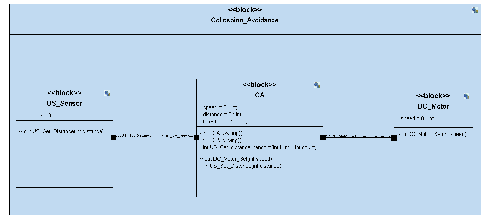
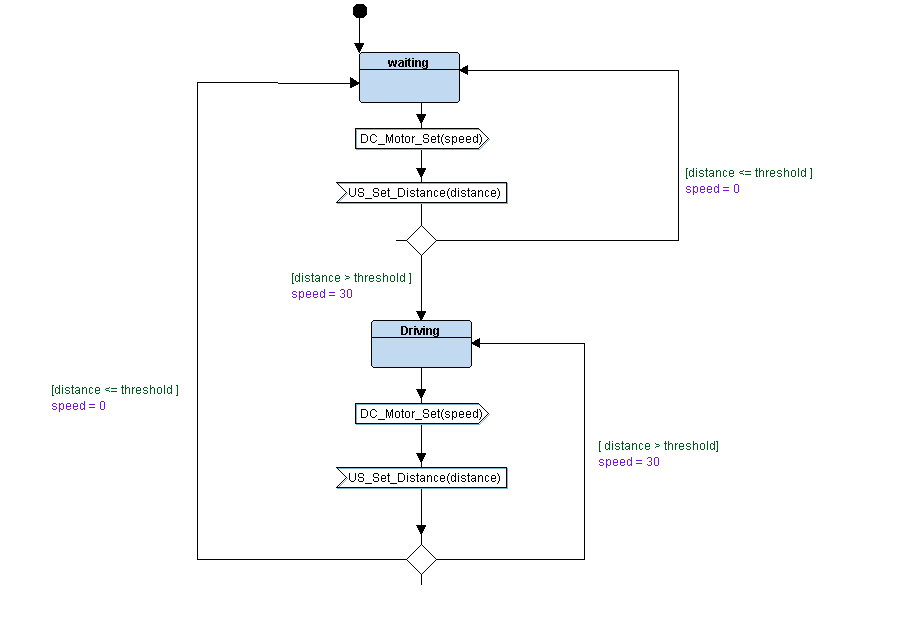
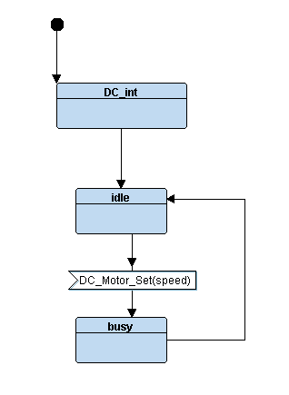
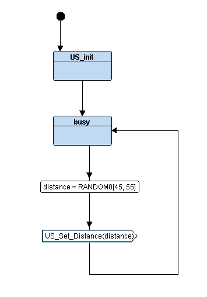
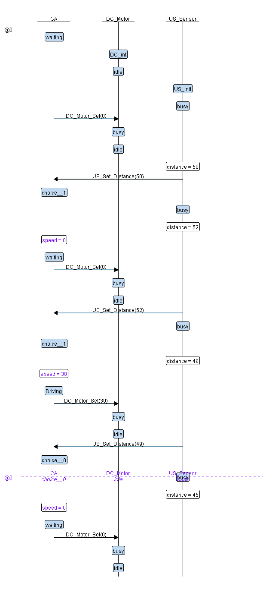

# Collosion Avoidance

Avoid collosion using Ultra-sonic sensor and DC motor. The implementation follows state machine approache.

## UML Block Digram
 

## AC Block State Machine
 

## DC Motor Block State Machine
 

## Ultra-sonic Block State Machine
 

## Interactive Simulation
 

