# Pressure Detection
First Term Project 
||||
| :- | :- | :- |
|Abdulrahman Hassanin Ali |12/31/22 |Learn-in-depth |
||||

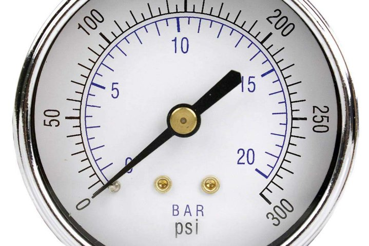

# Content 

1. [Problem Statement](#ProblemStatement)
1. [Goal](#Goal)
1. [Specification](#Specification) 
1. [Method](#Method) 
1. [Requirement Diagram](#RequirementDiagram) 
1. [Space Exploration](#SpaceExploration)
1. [System Analysis](#SystemAnalysis) 
   1. [Use Case Diagram](#UseCase)
   1. [Activity Diagram](#activity)
   1. [Sequence Diagram](#seq)
1. [System Design](#sysdesign)
   1. [Block (Instance) DiagramPressure Sensor Driver](#block) 
   1. [Pressure Driver](#pressure)
   1. [Pressure Detection](#pressureDetect)
   1. [Alarm Monitor](#AlarmMonitor)
   1. [Alarm Actuator Driver](#AlarmAct)
   1. [System Design Simulation](#Sim)
1. [System Simulation](#prot)
1. [Software Analysis](#analysis)
    1. [Memory Map](#mem)

##  1. Problem Statement 

The more we travel up in the air, pressure decreases. Airplane travels up and down causes the air pressure changing. This problem is dangerous for passengers. 

## 2  Goal 

Develop a device to control and manage the air pressure in the crew cabin. 

## 3  Specification 

Pressure Detection informs the crew of a cabin with an alarm, when the pressure exceeds 20 bars in the cabin. 

- The alarm duration equal 60 seconds. 
- Optional: Keep track of the measured value. 

## 4  Method 

The V-model is the used method for developing and testing. 

## 5  Requirement Diagram 

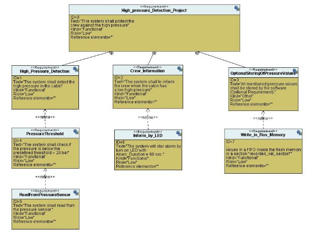

## 6  Space Exploration 

STM32 Microcontroller will be used. 

## 7  System Analysis 

### 7.1 Use Case Diagram 

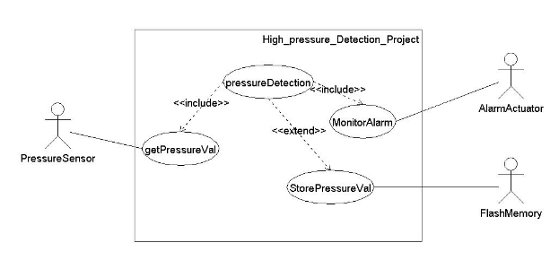

### 7.2 Activity Diagram 

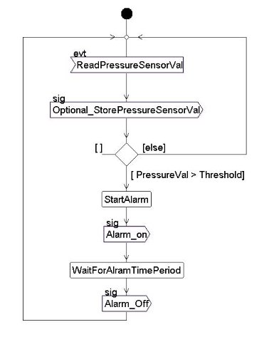

### 7.3 Sequence Diagram 

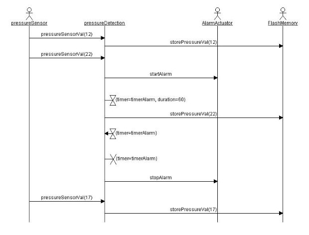

## 8  System Design 

### 8.1 Block (Instance) Diagram 

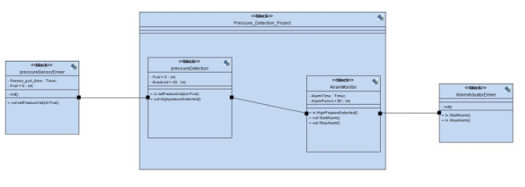

### 8.2 Pressure Sensor Driver 

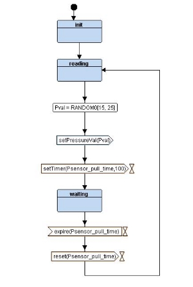

### 8.3 Pressure Detection 

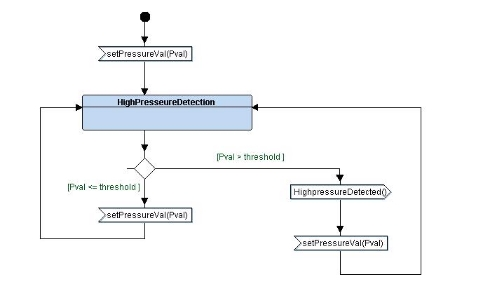

### 8.4 Alarm Monitor 

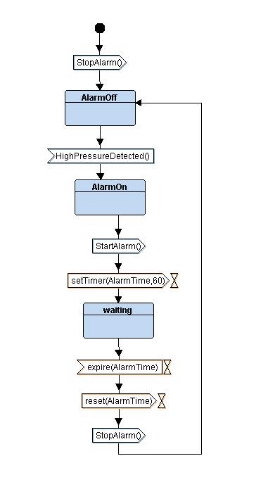

### 8.5 Alarm Actuator Driver 

### 8.6 System Design Simulation 

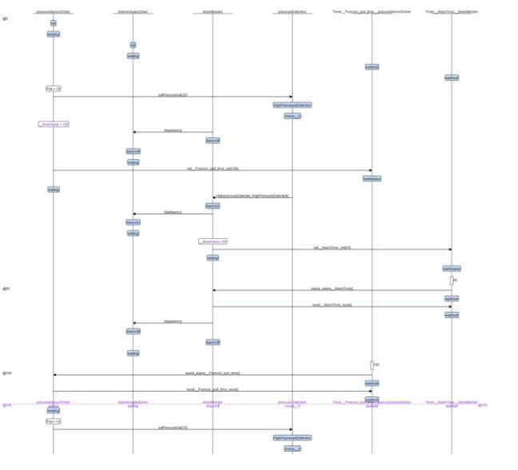

## 9  System Simulation 

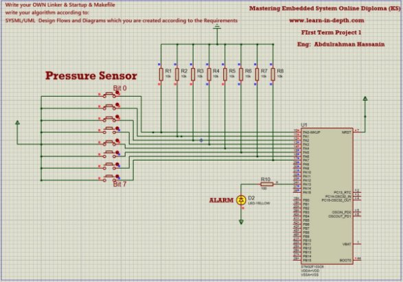

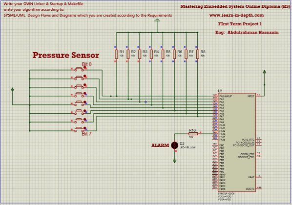

## 10 Software Analysis 

### 10.1  Object files section 

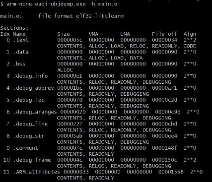

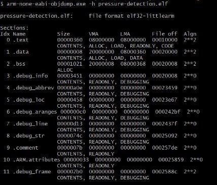

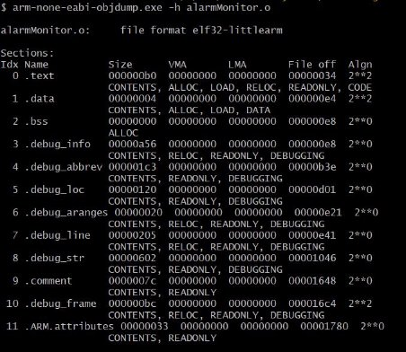

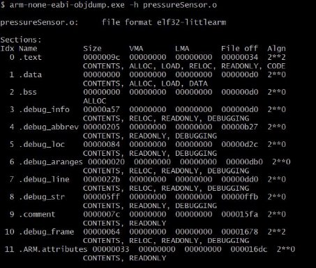

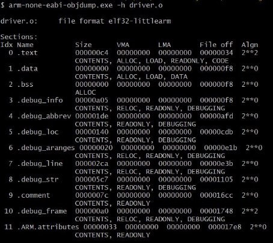

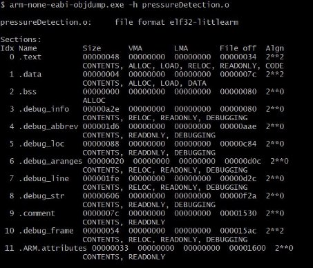